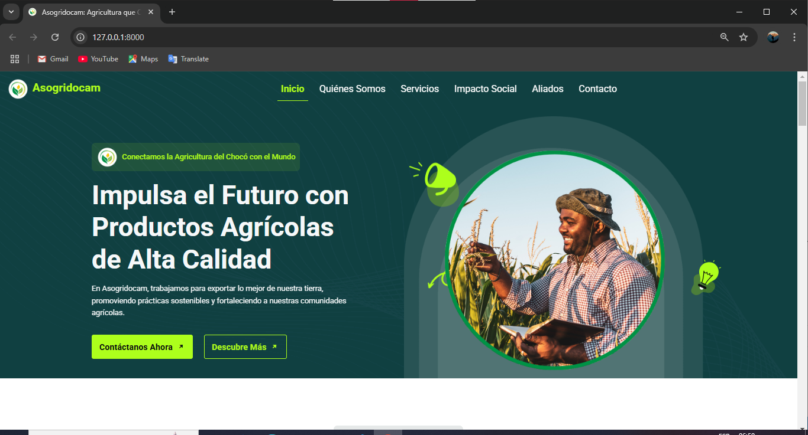

# Asogridocam: Agricultura que Conecta

Asogridocam es una asociación agrícola dedicada a conectar a los agricultores del Chocó, Colombia, con el mercado internacional, promoviendo productos agrícolas de alta calidad y fomentando el desarrollo sostenible.

## 📖 Descripción General

### 🌱 Misión del Proyecto
Conectar a los agricultores locales del Chocó con compradores internacionales mediante el uso de tecnología avanzada. Buscamos mejorar la calidad de vida de las comunidades agrícolas y promover prácticas sostenibles que beneficien tanto a los agricultores como al medio ambiente.

### 🌍 Impacto
Este proyecto tiene un impacto significativo en las comunidades agrícolas del Chocó, proporcionando:
- Acceso a mercados globales.
- Mejora en las prácticas agrícolas.
- Desarrollo económico sostenible.

---

## 🚀 Alcance Tecnológico

El proyecto está desarrollado en **Django**, utilizando formularios dinámicos y un diseño adaptativo para garantizar una experiencia de usuario intuitiva y accesible desde cualquier dispositivo.

### ✨ Características Principales
- **Formulario de Contacto Dinámico:** Permite a los usuarios enviar mensajes y consultas de manera eficiente.
- **Suscripción a Boletines:** Los usuarios pueden suscribirse para recibir actualizaciones y noticias.
- **Diseño Intuitivo y Adaptativo:** Compatible con diferentes dispositivos.
- **Multilenguaje:** Soporte para múltiples idiomas (si aplica).
- **Extensibilidad:** Preparado para incorporar futuras funcionalidades.

### 🔧 Tecnologías Utilizadas
- **Backend:** Django, Python  
- **Frontend:** HTML5, CSS3, JavaScript  
- **Bases de Datos:** PostgreSQL  
- **Otras Herramientas:** Bootstrap, AOS (para animaciones)

---

## 🤝 Contribuciones
Nos encantaría recibir contribuciones de otros desarrolladores. Puedes colaborar en el proyecto siguiendo estas pautas:

- **Crea issues para reportar errores o sugerir mejoras.**
- **Envía pull requests con tus contribuciones.**

---

## 📂 Estructura del Proyecto

asogridocam/
├── asoapp/
│   ├── __init__.py
│   ├── admin.py
│   ├── apps.py
│   ├── forms.py
│   ├── models.py
│   ├── tests.py
│   ├── urls.py
│   ├── views.py
├── asogridocam/
│   ├── __init__.py
│   ├── asgi.py
│   ├── settings.py
│   ├── urls.py
│   ├── wsgi.py
├── static/
│   ├── css/
│   ├── images/
│   ├── js/
├── templates/
│   ├── includes/
│   ├── index.html
├── manage.py

---

## 📬 Contacto
Si tienes preguntas o deseas colaborar, puedes contactarnos a través de:

- **Nombre:** Adalberto González Cuesta
- **Correo:** info@netxora.com

---

## 🖼️ Previsualización



---

## ⚙️ Instalación

Sigue estos pasos para clonar el repositorio, instalar dependencias y ejecutar el proyecto localmente:

```bash
git clone <URL_DEL_REPOSITORIO>
cd nombre-del-proyecto
pip install -r requirements.txt
python manage.py runserver
```
